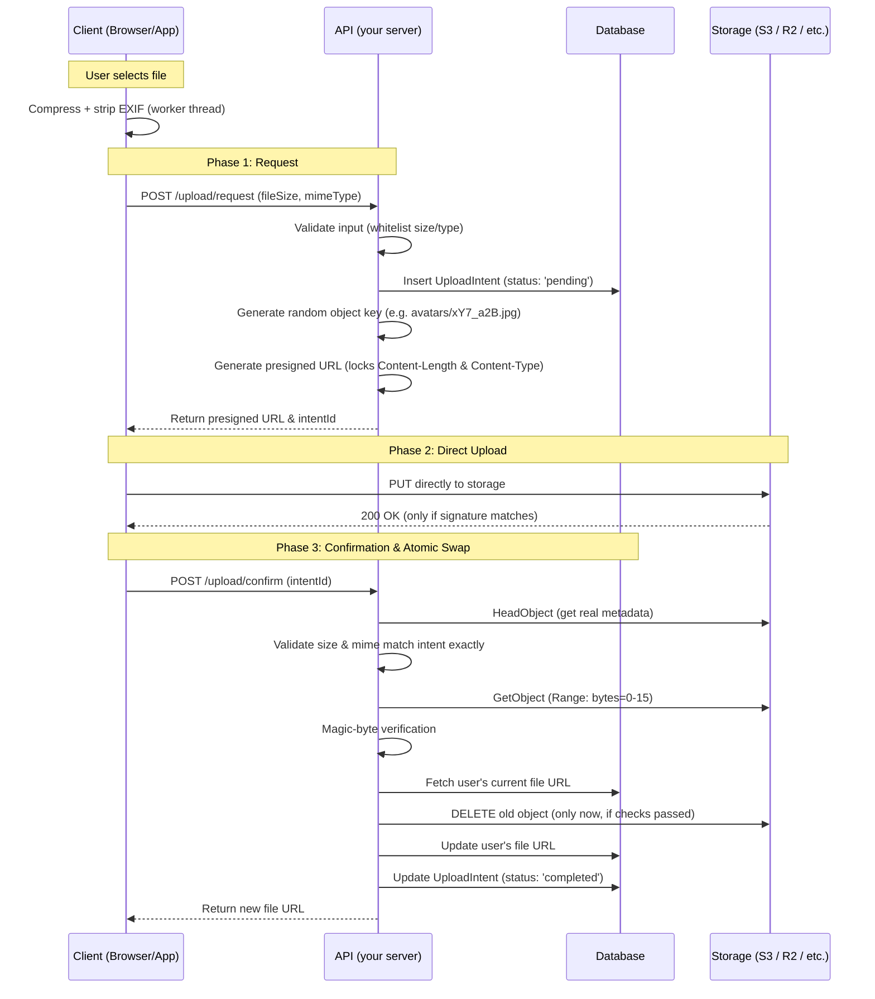

# Architecture & Flow

Full end-to-end lifecycle of a secure, direct-to-storage file upload.

## Pros

- **Zero server bandwidth**: file bytes never pass through your app server; storage handles the heavy lifting.
- **Cache-busting by default**: a random object key per upload means CDNs never serve a stale cached image after a new upload — no manual cache invalidation needed.
- **Atomic rollback safety**: the old file is only deleted after the new one is fully verified, so a failed/interrupted upload never leaves the user with a broken or missing file.
- **Hard to bypass security**: the presigned URL itself rejects wrong size/type at the storage edge, and the server does an independent second check afterward (magic bytes) — defense in depth, not just one layer.

## Cons / trade-offs to mention to the user

- **More round-trips**: 3 network calls (request → PUT → confirm) instead of one simple form POST. Worth it for anything beyond a toy project; probably overkill for a quick internal admin tool with 2 users.
- **Orphaned files edge case**: if the client uploads to storage but never calls `/confirm` (tab closed, network drop), the object sits unclaimed. This is why the cleanup job (Layer 5 in the security model, see `security-model.md`) is not optional — skipping it means storage cost creeps up silently over time.
