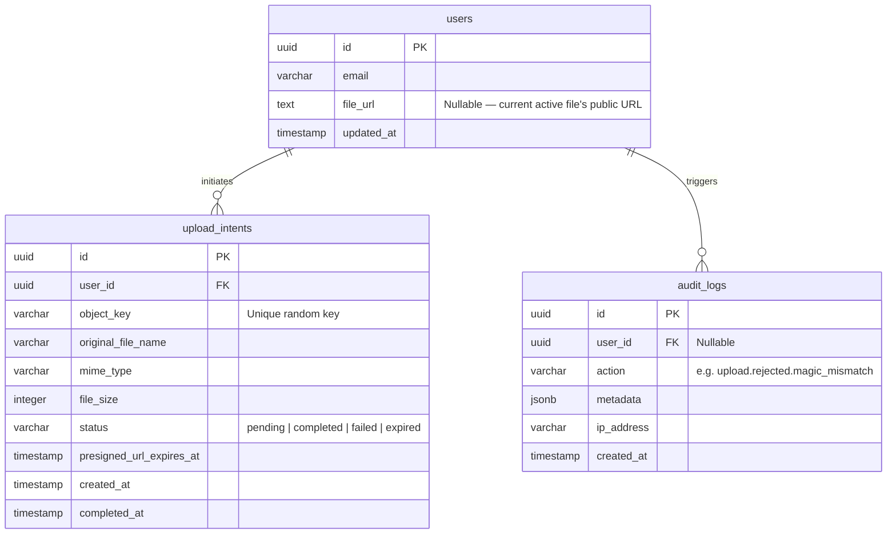

# Database Schema

Adapt table/column names to the project's existing conventions and ORM — the shape below is what matters, not the exact SQL dialect.

## `upload_intents` — the state machine

This table is the backbone of the atomic-swap pattern. Because the client uploads directly to storage (bypassing the server), the server needs an independent record of what *should* be happening.

- **Created `pending`**: the moment `/upload/request` hands out a presigned URL.
- **→ `completed`**: `/upload/confirm` passed HeadObject + magic-byte checks and the DB swap succeeded.
- **→ `failed`**: `/upload/confirm` ran but a verification check failed — the bad object is deleted from storage, the row is marked `failed`, and the user's existing file is left untouched.
- **→ `expired`**: the cleanup job found this intent still `pending` after ~5 minutes (browser closed mid-upload, network dropped, etc.) — the orphaned storage object is deleted.

## `audit_logs` — forensics, not just logging

Insert a row on every security-relevant event, not just failures:
- `upload.requested` — presigned URL handed out
- `upload.confirmed` — verified and swapped successfully
- `upload.rejected.size_mismatch` / `upload.rejected.magic_mismatch` — include the offending hex bytes in `metadata` for later analysis; this is what lets you spot a pattern of attack rather than a one-off client bug.
